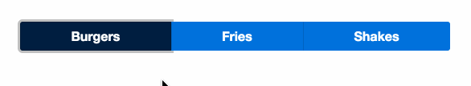

# 1.0 - Radio Component

Complete the implementation of _*app/radio.ts*_ and _*app/app-component.ts*_

## Expected Results

The radio component should:

- Accept an array of objects where each object has a `title` and `value`.
- The title should be displayed as the button text.
- It should also accept a `selected` value.
- When a button is clicked the selected value should be set to that value of the button by emitting change up to the parent.

Also, the following classes need to be applied to the buttons:

- `bg-navy` if the `button.value === selected`
- `rounded-left`: if it's the first button
- `border-left`: if it's *not* the first button
- `not-rounded`: if it's *not* the first or the last button
- `rounded-right`: if it's the last button

