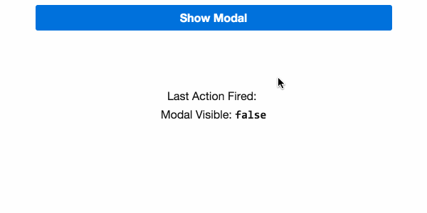

# 1.0 - Modal Component

Complete the implementation of _*app/modal.ts*_ such that you can:

1. Set the visibility of the modal using a property: `isVisible`.

2. Use projection to place all `<button>`s into the third `div` of the modal template – the actions section. Tagged as: `<!-- All actions go here -->`

3. Use projection to place any other content in the second `div` of the modal template – the body section. Tagged as: `<!-- All content goes here -->`

4. Provide 2-way binding for the `isVisible` prop.

5. Wire up the close button to hide the modal.


Complete the implementation of  _*app/app-component.ts*_ such that:

1. This content is projected to the body section of the modal.
  ```html
  <p class="m0">Bacon ipsum dolor sit amet chuck prosciutto landjaeger ham hock filet mignon shoulder hamburger pig venison. Ham bacon corned beef, sausage kielbasa flank tongue pig drumstick capicola swine short loin ham hock kevin. Bacon t-bone hamburger turkey capicola rump short loin.</p>
  ```

2. These buttons should be projected to the actions section of the modal.

  ```html
  <button class="btn caps"
    (click)="action('Share')">
    Share
  </button>
  <button class="btn caps"
    (click)="action('Explore')">
    Explore
  </button>
  ```

## Expected Results


