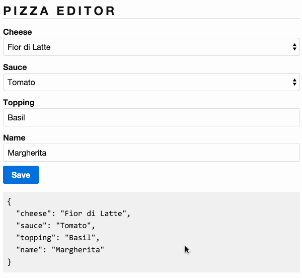

# 1.0 - Pizza Editor

For this exercise you are asked to build a pizza editor form for a very opinionated pizzeria. The model for a pizza is described in _*app/pizza.ts*_. You are asked to complete the implementation of _*app/pizza-editor.ts*_ and _*app/pizza-editor.html*_ such that a user can modify these values. The acceptable values for the `cheese` and `sauce` are already placed in the template. Additionally the submit function has already been implemented.

## Expected Results

When the values are modified and the user clicks on `save` the values in grey box should update to match.

