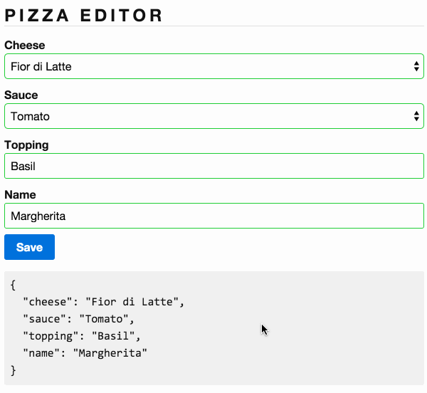

# 2.0 - Pizza Editor Validations

Now that we have a pizza editor let's add some validations to it. Complete the implementation of _*app/pizza-editor.ts*_ and _*app/pizza-editor.html*_ such that:

- `cheese`, `sauce` and `name` are required.
- All fields should get a `red` border if invalid and a `green` one if valid. Use the `@Component` decorator's `styles` property to define this.
- Display the `Name is required` alert if nothing provided. The alert box is already in the template.
- The `save` button should be disabled until the form is valid.

## Expected Results

