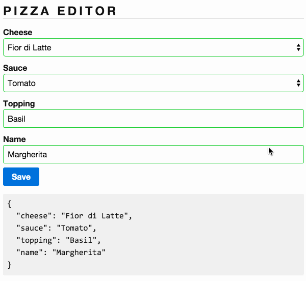

# 3.0 - Pizza Editor Custom Validations

In addition to the validations you built in the previous exercise the pizzeria wants to add some custom validations. Complete the implementation of _*app/custom-validators.ts*_, _*app/pizza-editor.ts*_ and _*app/pizza-editor.html*_ to add two custom validations:

1. **Acceptable Topping** the user can specify only one topping and valid toppings are listed below. The topping input must remain a text field and the value is case insensitive.

  ```js
  ['tomato', 'basil', 'garlic', 'eggplant', 'onion', 'salami', 'prosciutto']
  ```

2. **Duplicate Name** check the back-end to see whether the entered name is available or not. This will be an async validation. You can simulate the async part using the function below:

  ```js
  setTimeout(() => {
    if (control.value.toLowerCase() === 'calabrese') {
      resolve(/* ERROR GOES HERE */);
    } else {
      resolve(null);
    }
  }, 1000);
  ```

Display appropriate error messages when the validation fails.

Display the `Checking name availability...` message when the async validator is executing.


## Expected Results


