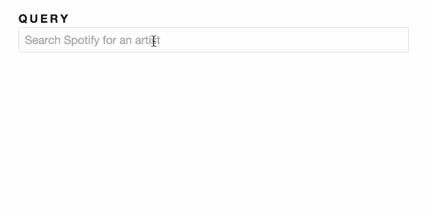

# 1.0 - Spotify Search

Complete the implementation of _*app/artist-search.ts*_  and _*app/search-service.ts*_ such that:

1. As the user enters the query make a `GET` request to Spotify API and return a `JSON` response.

2. Ensure you are not overloading the API by adding a `400ms` debounce.

3. Re-shape the data coming from the API to the following format:

  ```js
  [{
    name: 'artist.name',
    popularity: 'artist.popularity',
    image: 'artist.images[0].url'
    // ☝ if available otherwise use 'https://placehold.it/128?text=N%2FA'
  }]
  ```

_Hint:_ Consider using `flatMap` to combine two observables.

## Expected Results


