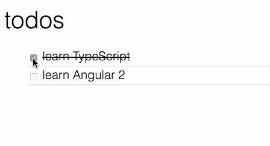

# 2.0 - Dispatch the Toggle Action

Make the text of each todo aware of the state of checkbox.  Change events emitted by the checkbox should fire actions.  The element containing the text should be aware of the checked status and render as strikethrough when checked and plain text when unchecked. 
 

**Expected Results**:

