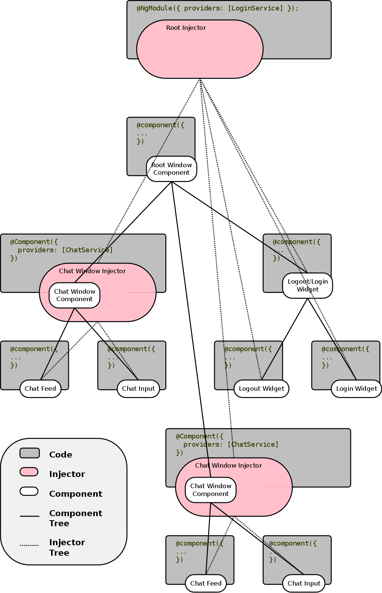

<!-- START doctoc generated TOC please keep comment here to allow auto update -->
<!-- DON'T EDIT THIS SECTION, INSTEAD RE-RUN doctoc TO UPDATE -->


- [Part 5: Angular 2 Dependency Injection](#part-5-angular-2-dependency-injection)
  - [What is DI?](#what-is-di)
  - [DI Framework](#di-framework)
  - [Angular 2's DI](#angular-2s-di)
    - [`@Inject` and `@Injectable`](#@inject-and-@injectable)
  - [Injection, Beyond Classes](#injection-beyond-classes)
  - [The Injector Tree](#the-injector-tree)

<!-- END doctoc generated TOC please keep comment here to allow auto update -->

# Part 5: Angular 2 Dependency Injection 

Dependency injection (DI) was a core feature in Angular 1.x, and that has not changed in Angular 2.  DI is a programming concept that predates Angular.  The purpose of DI is to simplify dependency management in software components. By reducing the amount of information a component needs to know about its dependencies, unit testing can be made easier, and code is more likely to be flexible.

Angular 2 improves on Angular 1.x's DI model by unifying Angular 1.x's two injection systems.  Tooling issues with respect to static analyis, and minification have also been fixed in Angular 2.  Namespace collisions have also been addressed in Angular 2.

## What is DI?

So dependency injection makes programmers' lives easier, but what does it
_really_ do?

Consider the following code:

```js

class Hamburger {
  private bun: Bun;
  private patty: Patty;
  private toppings: Toppings;
  constructor() {
    this.bun = new Bun('withSesameSeeds');
    this.patty = new Patty('beef');
    this.toppings = new Toppings(['lettuce', 'pickle', 'tomato']);
  }
}

```

The above code is a contrived class that represents a hamburger.  The class
assumes a `Hamburger` consists of a `Bun`, `Patty`, and `Toppings`.  The class 
is also responsible for _making_ the `Bun`, `Patty`, and `Toppings`.  This is a 
bad thing. What if a vegetarian burger were needed?  One naive approach might 
be:

```js

class VeggieHamburger {
  private bun: Bun;
  private patty: Patty;
  private toppings: Toppings;
  constructor() {
    this.bun = new Bun('withSesameSeeds');
    this.patty = new Patty('tofu');
    this.toppings = new Toppings(['lettuce', 'pickle', 'tomato']);
  }
}
```

There, problem solved right? But what if we need a gluten free hamburger? What
about if we want different toppings... maybe something more generic like:

```js

class Hamburger {
  private bun: Bun;
  private patty: Patty;
  private toppings: Toppings;
  constructor(bunType: string, pattyType: string, toppings: string[]) {
    this.bun = new Bun(bunType);
    this.patty = new Patty(pattyType);
    this.toppings = new Toppings(toppings);
  }
}
```

Okay this is a little different, and it's more flexible in some ways, but it is
still quite brittle.  What would happen if the `Patty` constructor changed to
allow for new features?  The whole `Hamburger` class would have to be updated.
In fact, any time any of these constructors used in `Hamburger`'s constructor
are changed, `Hamburger` would also have to be changed.

Also, what happens during testing? How can `Bun`, `Patty`, and `Toppings` be
effectively mocked?

Taking those concerns into consideration, the class could be re-written as:

```js

class Hamburger {
  private bun: Bun;
  private patty: Patty;
  private toppings: Toppings;
  constructor(bun: Bun, patty: Patty, toppings: Toppings) {
    this.bun = bun;
    this.patty = patty;
    this.toppings = toppings;
  }
}
```

Now when `Hamburger` is instantiated it does not need to know anything about its
`Bun`, `Patty`, or `Toppings`.  The construction of these elements has been
moved out of the class.  This pattern is so common that TypeScript allows it to
be written in shorthand like so:

```js

class Hamburger {
  constructor(private bun: Bun, private patty: Patty, 
    private toppings: Toppings) {}
}
```


The `Hamburger` class is now simpler, and easier to test.  This model of having
the dependencies provided to `Hamburger` is basic dependency injection.

However there is still a problem.  How can the instantiation of `Bun`, 
`Patty`, and `Toppings` best be managed?

This is where dependency injection as a _framework_ can benefit programmers, and
it is what Angular 2 provides with its dependency injection system.

## DI Framework

So there's a fancy new `Hamburger` class that is easy to test, but it's
currently awkward to work with.  Instantiating a `Hamburger` requires:

```js

const hamburger = new Hamburger(new Bun(), new Patty('beef'), new Toppings([]));
```

That's a lot of work to create a `Hamburger`, and now all the different pieces
of code that make `Hamburger`s have to understand how `Bun`, `Patty`, and 
`Toppings` get instantiated.

One approach to dealing with this new problem might be to make a factory
function like so:

```js

function makeHamburger() {
    const bun = new Bun();
    const patty = new Patty('beef');
    const toppings = new Toppings(['lettuce', 'tomato', 'pickles']);
    return new Hambuerger(bun, patty, toppings);
}
```

This is an improvement, but when more complex `Hamburger`s need to be created
this factory will become confusing.  The factory is also responsible for 
knowing how to create four different components.  This is a lot for one
function.

This is really where a dependency injection framework can help.  DI Frameworks
generally have the concept of an `Injector` object.  An Injector is a lot like
the factory function above, but more general, and powerful.  Instead of one
giant factory function, an Injector has a factory, or _recipe_ (pun intended)
for a collection of objects.  With an `Injector` creating a `Hamburger` could be
as easy as:

```js

const injector = new Injector([Hamburger, Bun, Patty, Toppings]);
const burger = injector.get(Hamburger);
```

## Angular 2's DI

The last example introduced a hypothetical `Injector` object.  Angular 2 
simplifies DI even further.  With Angular 2, developers almost never have to get
bogged down with injection details.

Angular 2's DI system is very subtle.  It's not obvious, but calling Angular 2's
bootstrap function initializes Angular 2's injection framework.

For example:

```js

import {bootstrap} from 'angular2/platform/browser';
import {App} from './path/to/your/root/component';

bootstrap(App)
```

Believe it or not, the above example creates the root injector.  This example is
too primitive though, the injector is not told about anything.

```js
import {bootstrap} from 'angular2/platform/browser';
import {Injectable} from 'angular2/core';
import {App} from './path/to/your/root/compoent';

@Injectable()
class Hamburger {
  constructor(private bun: Bun, private patty: Patty, 
    private toppings: Toppings) {}
}

bootstrap(App, [Hamburger]);
```

In the above example the root injector is initialized, and told about the
`Hamburger` class.  Another way of saying this, is that Angular 2 has been
_provided_ a `Hamburger`.

That seems pretty straightforward, but astute readers will be wondering how
Angular 2 knows how to build `Hamburger`.  What if `Hamburger` was a string, or
a plain function? 

Angular 2 _assumes_ that it's being given a class.

What about `Bun`, `Patty`, and `Toppings`, how is `Hamburger` getting those?

It's not, at least not yet.  Angular 2 does not know about them yet.  That can
be changed easily enough:

```js
import {bootstrap} from 'angular2/platform/browser';
import {Injectable} from 'angular2/core';
import {App} from './path/to/your/root/compoent';

@Injectable()
class Hamburger {
  constructor(private bun: Bun, private patty: Patty, 
    private toppings: Toppings) {}
}

@Injectable()
class Patty {}

@Injectable()
class Bun {}

@Injectable()
class Toppings {}

// provide injectables to Angular 2
bootstrap(App, [Hamburger, Patty, Bun, Toppings]);
```

Okay, this is starting to look a little bit more complete.  The key take away
here is `bootstrap(App, [Hamburger, Patty, Bun, Toppings])`.  The second 
parameter is an array of `providers`.

Although it's still unclear how `Hamburger` is being told about its 
dependencies.  Perhaps that is related to those odd `@Injectable` statements.

### `@Inject` and `@Injectable`

Statements that look like `@SomeName` are decorators.  [Decorators][decorators] 
are a proposed extension to JavaScript.  In short decorators let developers 
modify, and/or tag methods, classes, properties, and parameters.  There is a lot
to decorators. In this section the focus will be on decorators relevant to DI,
which are, `@Inject`, and `@Injectable`.  For more information on Decorators
please see [the features section][features].

`@Inject()` is a _manual_ mechanism for letting Angular 2 know that a 
_parameter_ needs to be injected.  It can be used like so:
 
```js
 
 import {Component, Inject, provide} from 'angular2/core';
 import {Hamburger} from '../services/hamburger';
 
 @Component({
   selector: 'app',
   template: `Bun Type: {{ bunType }}`
 })
 export class App {
   bunType: string;
   constructor(@Inject(Hamburger) h) {
     this.bunType = h.bun.type;
   }
 }

```
 
When using TypeScript, `@Inject` is only needed for injecting _primitives_,
TypeScript's types let Angular 2 know what to do in most cases.  The above
example would be simplified in TypeScript to:
 
```js
 
 import {Component, Inject, provide} from 'angular2/core';
 import {Hamburger} from '../services/hamburger';
 
 @Component({
   selector: 'app',
   template: `Bun Type: {{ bunType }}`
 })
 export class App {
   bunType: string;
   constructor(h: Hamburger) {
     this.bunType = h.bun.type;
   }
 }

```
[View Example][plunkBurger1]


`@Injectable()` lets Angular 2 know that a _class_ can be used with the 
dependency injector.  `@Injectable()` is not _strictly_ required if the class 
has _other_ Angular 2 decorators on it.  What is important is that any class 
that is going to be injected with Angular 2 _is decorated_.  However _best
practice_ is to decorate injectables with `@Injectable()`, as it is makes more
sense to the reader.

Here's an example of `Hamburger` marked up with `@Injectable`

```js

import {Injectable} from 'angular2/core';
import {Bun} from './bun';
import {Patty} from './patty';
import {Toppings} from './toppings';

@Injectable()
export class Hamburger {
  constructor(public bun: Bun, public patty: Patty, public toppings: Toppings) {
  }
}
```

In the above example Angular 2's injector determines what to inject into
`Hamburger`'s constructor by using type information.  This is possible because
these particular dependencies are typed, and are _not primitive_ types.
In some cases Angular 2's DI need's more information than just types.


## Injection, Beyond Classes

So far the only types that injection has been used for have been classes.  
Angular 2 is _not_ limited to injecting classes.  The concept of `providers` was
also briefly touched upon.

So far `providers` have been passed to Angular 2's `bootstrap` function in an
array.  `providers` have also all been class identifiers.  Angular 2 lets
developers specify providers with a more verbose "recipe". This is done with
Angular 2's `provide` function, like so:

```js

import {App} from './containers/app'; // hypothetical app component
import {Hamburger} from './services/hamburger'; 
import {bootstrap} from 'angular2/platform/browser';
import {provide} from 'angular2/core';

bootstrap(App, [provide(Hamburger, { useClass: Hamburger })]);

```

This example is yet another example that `provides` a class, but it does so with
Angular 2's longer format.  The second parameter to the `provide` function lets
developers "use" things other than classes for dependency injection.

This long format is really handy.  If the developer wanted to switch out
`Hamburger` implementations, to allow for say a `DoubleHamburger` they could
do this easily:

```js

import {App} from './containers/app'; // hypothetical app component
import {DoubleHamburger} from './services/double-hamburger'; 
import {bootstrap} from 'angular2/platform/browser';
import {provide} from 'angular2/core';

bootstrap(App, [provide(Hamburger, { useClass: DoubleHamburger })]);

```

The best part of this implementation swap is that the injection system _knows_
how to build `DoubleHamburgers`, and will sort out all of that out. 


The injector can use more than classes though.  `useValue`, and `useFactory` are
two other examples of `provider` "recipes" that Angular 2 can use.  For example:

```js

import {App} from './containers/app'; // hypothetical app component
import {bootstrap} from 'angular2/platform/browser';
import {provide} from 'angular2/core';

const randomFactory = () => { return Math.random(); };
const randomDefinition = { useFactory: randomFactory };

bootstrap(App, [provide('Random', randomDefinition)]);

```

In the hypothetical app component, 'Random' could be injected like:

```js

import {Component, Inject, provide} from 'angular2/core';
import {Hamburger} from '../services/hamburger';

@Component({
  selector: 'app',
  template: `Random: {{ value }}`
})
export class App {
  value: number;
  constructor(@Inject('Random') r) {
    this.value = r;
  }
}
```
[View Example][plunkRandom1]

One important note is that 'Random' is in quotes, both in the `provide` 
function, and in the consumer.  This is because as a factory we have no `Random`
identifier anywhere to access.

The above example uses Angular 2's `useFactory` recipe.  When Angular 2 is told
to `provide` things using `useFactory` Angular 2 expect the provided value to be
a function.  Sometimes functions, and classes are even more than what's needed.
Angular 2 has a "recipe" called `useValue` for these cases, it works almost
exactly the same:

```js

import {bootstrap} from 'angular2/platform/browser';
import {provide} from 'angular2/core';
import {App} from './containers/app';

const randomDefinition = { useValue: Math.random() };

bootstrap(App, [provide('Random', randomDefinition)]);
```

[View Example][plunkRandom2]

In this case, the product of `Math.random` is assigned to the `useValue` 
property passed to the `provider`.  


## The Injector Tree

Angular 2 injectors (generally) return singletons.  That is, in the previous example, all components in the application will receive the _same_ random
number.  In Angular 1.x there was only one injector, and all _services_ were
singletons.  Angular 2 overcomes this limitation by using a tree of injectors.

In Angular 2 there is not just one injector per application, there is _at least_ one injector per application.  Injectors are organized in a tree that parallels Angular 2's component tree.

Consider the following tree, which models a chat application consisting of two
open chat windows, and a login/logout widget.



In the image above, there is one root injector, which is also the root
component.  This is also the application bootstrap area.  There's a 
`LoginService` registered with the root injector.

There are also two child injectors, one for each `ChatWindow` component.  Each 
one of these components has their _own_ instantion of a `ChatService`.

There is a third child component, `Logout/Login` component , but it has no 
injector.

There are several grandchild components that have no injectors.  There are
`ChatFeed`, and `ChatInput` components for each `ChatWindow`.  There are also
`LoginWidget`, and `LogoutWidget` components with `Logout/Login` as their
parent.

The injector tree does _not_ make a new injector for every component.  The injector tree _does_ make a new injector for every component with a `providers` array in its decorator.  Components that have no `providers` array look to their parent component for an injector. If the parent does not have an injector, it looks up on, and on until it reaches the root injector.

_Warning:_ be careful with `provider` arrays.  If a child component is decorated with a `providers` array, and that array contains dependencies that were _also_ requested in the parent component(s) the dependencies the child receives will _shadow_ the parent dependencies.  This can have all sorts of unintended consequences.

Consider the following example:

app/boot.ts
```js
import {bootstrap} from 'angular2/platform/browser';
import {provide} from 'angular2/core';
import {App} from './containers/app';
import {Unique} from './services/unique';

bootstrap(App, [Unique]);

```

In the example above, `Unique` is bootstrapped into the root injector.

app/services/unique.ts
```js
import {Injectable} from 'angular2/core';

@Injectable()
export class Unique {
  value: string;
  constructor() {
    this.value = (+Date.now()).toString(16) + '.' + 
      Math.floor(Math.random() * 500);
  }
}
```

The `Unique` service, it generates a value unique to _its_ instance upon
instantiation

app/services/child-inheritor.ts
```js
import {Component, Inject} from 'angular2/core';
import {Unique} from '../services/unique';

@Component({
  selector: 'child-inheritor',
  template: `<span>{{ value }}</span>`
})
export class ChildInheritor {
  value: number;
  constructor(u: Unique) {
    this.value = u.value;
  }
}
```

The child inheritor has no injector, it will traverse the component tree
_upwards_ looking for an injector.

app/services/child-own-injector.ts
```js
import {Component, Inject} from 'angular2/core';
import {Unique} from '../services/unique';

@Component({
  selector: 'child-own-injector',
  template: `<span>{{ value }}</span>`,
  providers: [Unique]
})
export class ChildOwnInjector {
  value: number;
  constructor(u: Unique) {
    this.value = u.value;
  }
}
```

The child own injector component has injector that is populated with its own
instance of `Unique`.  This component will _not_ share the same value as the
root injector's `Unique` instance.

app/containers/app.ts
```js

import {Component, Inject, provide} from 'angular2/core';
import {Hamburger} from '../services/hamburger';
import {ChildInheritor} from '../components/child-inheritor';
import {ChildOwnInjector} from '../components/child-own-injector';
import {Unique} from '../services/unique';

@Component({
  selector: 'app',
  template: `
     <p>
     App's Unique dependency has a value of {{ value }}
     </p>
     <p>
     which should match
     </p>
     <p>
     ChildInheritor's value: <child-inheritor></child-inheritor>
     </p>
     <p>
     However,
     </p>
     <p>
     ChildOwnInjector should have its own value: <child-own-injector></child-own-injector>
     <p>
     Sibling of ChildOwnInjector should not have its own value <child-own-injector></child-own-injector>
     </p>
       `,
  directives: [ChildInheritor, ChildOwnInjector]
})
export class App {
  value: number;
  constructor(u: Unique) {
    this.value = u.value;
  }
}

```

[View Example][plunkInjectorTree]


[SODi]: http://stackoverflow.com/questions/130794/what-is-dependency-injection "Community Answers To What Is DI?"
[pascalDI]: http://blog.thoughtram.io/angular/2015/05/18/dependency-injection-in-angular-2.html "Dependency Injection in Angular 2"
[pascalDIservice]: http://blog.thoughtram.io/angular/2015/09/17/resolve-service-dependencies-in-angular-2.html "Service in Service DI"
[a2DImanual]: https://angular.io/docs/ts/latest/guide/dependency-injection.html "Angular 2's Beta docs for DI"
[decorators]: http://blog.wolksoftware.com/decorators-reflection-javascript-typescript "ES Decorators Explained"
[features]: ./000-features.md "Features Section"
[plunkBurger1]: https://plnkr.co/edit/KcBaZgbPZjuItiBjtEbD?p=preview "Hamburger DI Demo"
[plunkBurger2]: https://plnkr.co/edit/RTcjOlYwidYf3f2f0ESR?p=preview "Hamburger DI II"
[plunkRandom1]: https://plnkr.co/edit/FOcTlh2o37RdNVyxlTxk?p=preview "Random DI 1"
[plunkRandom2]: https://plnkr.co/edit/BV7r4FpkVtLMbbgFaBvj?p=preview "Random DI 2"
[plunkInjectorTree]: https://plnkr.co/edit/EUOpUi66mwEJCUOjpMQx?p=preview "Injector Tree Example"
