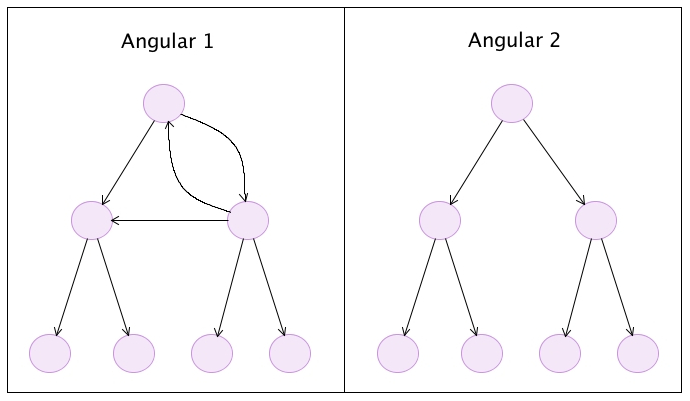

<!-- START doctoc generated TOC please keep comment here to allow auto update -->
<!-- DON'T EDIT THIS SECTION, INSTEAD RE-RUN doctoc TO UPDATE -->


- [Part 6: Change Detection](#part-6-change-detection)
  - [Change Detection Strategies in Angular 1 vs Angular 2](#change-detection-strategies-in-angular-1-vs-angular-2)
  - [How Change Detection Works](#how-change-detection-works)
- [MovieApp](#movieapp)
    - [{{ title }}](#-title-)
  - [Change Detector Classes](#change-detector-classes)
  - [Change Detection Strategy: Default](#change-detection-strategy-default)
  - [Performance Impact](#performance-impact)
  - [Change Detection Strategy: OnPush](#change-detection-strategy-onpush)
  - [Enforcing Immutability](#enforcing-immutability)
- [MovieApp](#movieapp-1)
  - [Additional Resources](#additional-resources)

<!-- END doctoc generated TOC please keep comment here to allow auto update -->

# Part 6: Change Detection

Change detection is the process that allows Angular to keep our views in sync with our models. 

Change detection has changed in a big way between the old version of Angular and the new one. In Angular 1, the framework kept a long list of watchers (one for every property bound to our templates) that needed to be checked everytime a digest cycle was started. This was called *dirty checking* and it was the only change detection mechanism available.

Because by default Angular 1 implemented two way data binding, the flow of changes was pretty much chaotic, models were able to change directives, directives were able to change models, directives were able to change other directives and models were able to change other models.

In Angular 2, **the flow of information is unidirectional**, even when using `ngModel` to implement two way data binding, which is only syntactic sugar on top of the unidrectional flow. In this new version of the framework, our code is responsible for updating the models. Angular is only responsible for reflecting those changes in the components and the DOM by means of the change detection.

_Change detection responsibilities_


## Change Detection Strategies in Angular 1 vs Angular 2

Another difference between both versions of the framework is the way the nodes of an application (directives or components) are checked to see if the DOM needs to be updated.

Because of the nature of two way data binding, in Angular 1 there was no guarantee that a parent node would always be checked before a child node. It was possible that a child node could also change a parent node or a sibling or any other node in the tree, and that in turn will trigger new updates down the chain. This made it difficult for the change detection mechanism to traverse all the nodes without falling in a circular loop with the infamous message:

```
10 $digest() iterations reached. Aborting!
```

In Angular 2, changes are guaranteed to propagate unidirectionally. The change detector will **traverse each node only once**, always starting from the root. That means that a parent component is always checked before its children components.

_Tree traversing in Angular 1 vs Angular 2_



## How Change Detection Works

Let's see how change detection works with a simple example.

We are going to create a simple `MovieApp` to show information about one movie. This app is going to consist of only two components, the `MovieComponent` that shows information about a movie, and the `MainComponent` which holds a reference to the movie with buttons to perform some actions.

As always, the first step is to create our `index.html` file using the html element defined in the root component of our app `MainComponent`.

_index.html_
```html
<html>
  <!-- ... -->
  <body>
    <main>Loading...</main>
  </body>
</html>
```

And the boot file to load the application.

_app/boot.ts_
```javascript
import {bootstrap} from 'angular2/platform/browser';
import {MainComponent} from './main.component';

bootstrap(MainComponent);
```

Then, our `MainComponent` will have three properties, the `slogan` of the app, the `title` of the movie and the lead `actor`. The last two properties are going to be passed to the `MovieComponent` element, referenced in the template.

_app/main.component.ts_
```javascript
import {Component} from 'angular2/core';
import {MovieComponent} from './movie.component';
import {Actor} from './actor.model';

@Component({
  selector: 'main',
  directives: [MovieComponent],
  template: `
    <h1>MovieApp</h1>
    <p>{{ slogan }}</p>
    <button type="button" (click)="changeActorProperties()">Change Actor Properties</button>
    <button type="button" (click)="changeActorObject()">Change Actor Object</button>
    <movie [title]="title" [actor]="actor"></movie>`
})
export class MainComponent {
  slogan: string = 'Just movie information';
  title: string = 'Terminator 1';
  actor: Actor = new Actor('Arnold', 'Schwarzenegger');
  
  changeActorProperties() {
    this.actor.firstName = 'Nicholas';
    this.actor.lastName = 'Cage';
  }
  
  changeActorObject() {
    this.actor = new Actor('Bruce', 'Willis');
  }
}
```

In the above code snippet, we can see that our component defines two buttons that trigger different methods. The `changeActorProperties` is going to update the lead actor of the movie by directly changing the properties of the `actor` object. In contrast, the method `changeActorObject` will change the information of the actor by creating a completely new instance of the `Actor` class.

The `Actor` model is pretty straightforward, it is just a class that defines the `firstName` and the `lastName` of an actor. 

_app/actor.model.ts_
```javascript
export class Actor {
  constructor(
    public firstName: string,
    public lastName: string) {}
}
```

Finally, the `MovieComponent` shows the information provided by the MainComponent in its template.

_app/movie.component.ts_
```javascript
import {Component, Input} from 'angular2/core';
import {Actor} from './actor.model';

@Component({
  selector: 'movie',
  styles: ['div {border: 1px solid black}'],
  template: `
    <div>
      <h3>{{ title }}</h3>
      <p>
        <label>Actor:</label>
        <span>{{actor.firstName}} {{actor.lastName}}</span>
      </p>
    </div>`
})
export class MovieComponent {
  @Input() title: string;
  @Input() actor: Actor;
}
```

The final result of the app is shown in the screenshot below.


## Change Detector Classes

At runtime, Angular 2 is going to create special classes that are called **change detectors**, one for every component that we have defined. In this case, Angular is going to create two classes: `MainComponent_ChangeDetector` and `MovieComponent_ChangeDetector`.

The goal of the change detectors is to know which model property, used in the template of a component, have changed since the last time the change detection process ran.

In order to know that, Angular is going to create an instance of the appropiate change detector class, and it will create a link to the component that its suppose to check. 

In our example, because we only have one instance of the `MainComponent` and the `MovieComponent` we are going to have only one instance of the `MainComponent_ChangeDetector` and the `MovieComponent_ChangeDetector`.

The code snippet below, is a conceptual model of how the `MainComponent_ChangeDetector` class could look.

```javascript
class MainComponent_ChangeDetector {
  
  constructor(
    public previousSlogan: string,
    public previousTitle: string,
    public previousActor: Actor,
    public movieComponent: MovieComponent 
  ) {} 
  
  detectChanges(slogan: string, title: string, actor: Actor) {
    if (slogan !== this.previousSlogan) {
      this.previousSlogan = slogan;
      this.movieComponent.slogan = slogan; 
    }
    if (title !== this.previousTitle) {
      this.previousTitle = title;
      this.movieComponent.title = title;
    }
    if (actor !== this.previousActor) {
      this.previousActor = actor;
      this.movieComponent.actor = actor; 
    }
  }
}
```

Because in the template of our `MainComponent` we are referencing three variables (`slogan`, `title` and `actor`), our change detector is going to have three properties to store the "old" values of these three properties, plus a reference to the `MainComponent` instance that it's supposed to "watch". When the change detection process wants to know if our `MainComponent` instance has changed, it will run the method `detectChanges` passing the current model values to compare with the old ones. If a change was detected, the component gets updated.

> Disclaimer: This is just a conceptual overview of how change detector classes work, the actual implementation may be different.  

## Change Detection Strategy: Default

By default, Angular defines a certain change detection strategy for every component in our application. To make this definition explicit, we can use the property `changeDetection` of the `@Component` decorator.

_app/movie.component.ts_
```javascript
// ...
import {ChangeDetectionStrategy} from 'angular2/core';

@Component({
  // ...
  changeDetection: ChangeDetectionStrategy.Default
})
export class MovieComponent {
  // ...
}
```

[View Example](http://plnkr.co/edit/n6m7rOtxG5MU0tsRl5xX?p=preview)

The enum `ChangeDetectionStrategy` defines seven strategies: `CheckOnce`, `Checked`, `CheckAlways`, `Detached`, `OnPush`, `Default` and `DefaultObserver` as can be seen in the [docs](https://angular.io/docs/ts/latest/api/core/ChangeDetectionStrategy-enum.html). We are going to concentrate on the two main ones: `Default` and `OnPush`.

Lets see what happens when a user clicks the button "Change Actor Properties" when using the `Default` strategy. 

As noted previously, changes are triggered by events and the propagation of changes is done in two phases: the application phase and the change detection phase.

**Phase 1 (Application):**

In the first phase, the application (our code) is responsible for updating the models in response to some event. In this scenario, the properties `actor.firstName` and `actor.lastName` are updated.

**Phase 2 (Change Detection):**

Now that our models are updated, Angular needs to update the templates using change detection.

Change detection always starts at the root component, in this case the `MainComponent` and it checks if any of the model properties bound to its template have changed, comparing the old value of each property (before the event was triggered) to the new one (after the models were updated). The `MainComponent` template has a reference to three properties, `slogan`, `title`, and `actor`, so the comparison made by its corresponding change detector will look like:

- Is `slogan !== previousSlogan`? No, it's the same.
- Is `title !== previousTitle`? No, it's the same.
- Is `actor !== previousActor`? No, it's the same.

Notice that even if we change the properties of the `actor` object, we are always working with the same instance. Because we are doing a shallow comparison, the result of asking if `actor !== previousActor` will always be `false` even when its internal property values have indeed changed. Even though the change detector was unable to find any change, the **default strategy** for the change detection is **to traverse all the components of the tree** even if they do not seem to have been modified.

Next, change detection moves down in the component hierarchy and check the properties bound to the `MovieComponent`'s template doing a similar comparison:

- Is `title !== previousTitle`? No, it's the same.
- Is `actorFirstName !== previousActorFirstName`? **Yes**, it has changed.
- Is `actorLastName !== previousActorLastName`? **Yes**, it has changed.

Finally, Angular has detected that some of the properties bound to the template have changed so it will update the DOM to get the view in sync with the model.

## Performance Impact

Traversing all the tree components to check for changes could be costly. Imagine that instead of just having one reference to `<movie>` inside our `MainComponent`'s template, we have multiple references?

```html
<movie *ngFor="#movie of movies" [title]="movie.title" [actor]="movie.actor"></movie>`
```

If our movie list grows too big, the performance of our system will start degrading. We can narrow the problem to one particular comparison.

- Is `actor !== previousActor`?

As we have learned, this result is of not much use because we could have changed the properties of the object without changing the instance, and the result of the comparison will always be `false`. Because of this, change detection is going to have to check every child component to see if any of the properties of that object (`firstName` or `lastName`) have changed.

What if we can find a way to indicate to the change detection that our `MovieComponent` depends only on its inputs and that these inputs are immutable? In short, we are trying to guarantee that when we change any of the properties of the `actor` object, we are going to end up with a different `Actor` instance so the comparison `actor !== previousActor` will always return `true`. On the other hand, if we did not change any property, we are not going to create a new instance, so the same comparison is going to return `false`.

If the above condition can be guaranteed (creating a new object every time any of its properties changes, otherwise we keep the same object), then when checking the inputs of the `MovieComponent` and having this result:

- Is `title !== previousTitle`? No, it's the same.
- Is `actor !== previousActor`? No, it's the same.

Then we can skip the internal check of the component's template because we are now certain that nothing has changed internally and there's no need to update the DOM. This will improve the performance of the change detection system because fewers comparisons have to be made to propagate changes through the app.

## Change Detection Strategy: OnPush

To inform Angular that we are going to comply with the conditions mentioned before to improve performance, we are going to use the `OnPush` change detection strategy on the `MovieComponent`.

_app/movie.component.ts_
```javascript
// ...

@Component({
  // ...
  changeDetection: ChangeDetectionStrategy.OnPush
})
export class MovieComponent {
  // ...
}
```

[View Example](http://plnkr.co/edit/bczNU8cnoNGnHckLbWt8?p=preview)

This will inform Angular that our component only depends on its inputs and that any object that is passed to it should be considered immutable. This time when we click the button "Change Actor Properties" nothing changes in the view.

Lets follow again the logic behind it. When the user clicks the button, the method `changeActorProperties` is called and the properties of the `actor` object get updated.

When the change detection analyzes the properties bound to the `MainComponent`'s template, it will see the same picture as before:

- Is `slogan !== previousSlogan` No, it's the same.
- Is `title !== previousTitle`? No, it's the same.
- Is `actor !== previousActor`? No, it's the same.

But this time, we explictly told Angular that our component only depends on its inputs and all of them are immutable. Angular then assumes that the `MovieComponent` hasn't changed and will skip the check for that component. Because we didn't force the `actor` object to be immutable, we end up with our model out of sync with the view.

Let's rerun the app but this time we will click the button `ChangeActorObject`. This time, we are creating a new instance of the `Actor` class and assigning it to the `this.actor` object. When change detection analyzes the properties bound to the `MainComponent`'s template it will find:

- Is `slogan !== previousSlogan` No, it's the same.
- Is `title !== previousTitle`? No, it's the same.
- Is `actor !== previousActor`? **Yes**, it has changed.

Because now change detection knows that the `actor` object changed (it's a new instance) it will go ahead and continue checking the template for `MovieComponent` to update its view. At the end, our templates and models end up being in sync.

## Enforcing Immutability

As we can see, in the previous example we cheated a little. We told Angular that all of our inputs, including the `actor` object, were immutable objects, but we went ahead and updated its properties violating the immutability principle. As a result we ended with a sync problem between our models and our views. One way to enforce immutability is using the library [Immutable.js](https://facebook.github.io/immutable-js/).

Because in javascript primitive types like `string` and `number` are immutable by definition, we should only take care of the objects we are using. In this case, the `actor` object.

> Here's an example comparing a mutable type like an `array` to an immutable type like a `string`:

```javascript
var b = ['C', 'a', 'r'];
b[0] = 'B';
console.log(b) // ['B', 'a', 'r'] => The first letter changed, arrays are mutable

var a = 'Car';
a[0] = 'B';
console.log(a); // 'Car' => The first letter didn't change, strings are immutable
``` 

First, we need to install the `immutable.js` library using the command:

```
npm install --save immutable
```

Then, in our `MainComponent` we import the library and use it to create an actor object as an immutable.

_app/main.component.ts_
```javascript
import {Component} from 'angular2/core';
import {MovieComponent} from './movie.component';
import {Immutable} from 'immutable';

@Component({
  selector: 'main',
  directives: [MovieComponent],
  template: `
    <h1>MovieApp</h1>
    <p>{{ slogan }}</p>
    <button type="button" (click)="changeActor()">Change Actor</button>
    <movie [title]="title" [actor]="actor"></movie>`
})
export class MainComponent {
  slogan: string = 'Just movie information';
  title: string = 'Terminator 1';
  actor: Immutable.Map<string, string> = Immutable.Map({firstName: 'Arnold', lastName: 'Schwarzenegger'});
  
  changeActor() {
    this.actor = this.actor.merge({firstName: 'Nicholas', lastName: 'Cage'});
  }
}
```

Now, instead of creating an instance of an `Actor` class, we are now defining an immutable object using `Immutable.Map`. Because `this.actor` is now an immutable object, we cannot change its internal properties `firstName` and `lastName` directly. What we can do however is create another object based on `actor` that has different values for both fields and that is exactly what the `merge` method does.

Because we are always getting a new object when we try to change the `actor`, there's no point in having two different methods in our component. We removed the methods `changeActorProperties` and `changeActorObject` and created a new one called `changeActor`.

Additional changes have to be made to the `MovieComponent` as well. First, we need to declare the `actor` object as an immutable, and in the template, instead of trying to access the object properties directly using a syntax like `actor.firstName`, we need to resort on the `get` method of the immutable.

_app/movie.component.ts_
```javascript
import {Component, Input} from 'angular2/core';
import {ChangeDetectionStrategy} from 'angular2/core';
import {Immutable} from 'immutable';

@Component({
  selector: 'movie',
  styles: ['div {border: 1px solid black}'],
  template: `
    <div>
      <h3>{{ title }}</h3>
      <p>
        <label>Actor:</label>
        <span>{{actor.get('firstName')}} {{actor.get('lastName')}}</span>
      </p>
    </div>`,
  changeDetection: ChangeDetectionStrategy.OnPush
})
export class MovieComponent {
  @Input() title: string;
  @Input() actor: Immutable.Map<string, string>;
}
```

[View Example](http://plnkr.co/edit/8b76FU9lMc6C43L2TIWB?p=preview)

Using this pattern we are taking full advantage of the "OnPush" change detection strategy and thus reducing the amount of work done by Angular to propagate changes and to get models and views in sync. This improves the performance of the application.

## Additional Resources

To learn more about change detection, visit the following links (in order of relevance):

- [NgConf 2014: Change Detection (Video)](https://www.youtube.com/watch?v=jvKGQSFQf10)
- [Angular API Docs: ChangeDetectionStrategy](https://angular.io/docs/ts/latest/api/core/ChangeDetectionStrategy-enum.html)
- [Victor Savkin Blog: Change Detection in Angular 2](http://victorsavkin.com/post/110170125256/change-detection-in-angular-2)
- [Victor Savkin Blog: Two Phases of Angular 2 Applications](http://victorsavkin.com/post/114168430846/two-phases-of-angular-2-applications)
- [Victor Savkin Blog: Angular, Immutability and Encapsulation](http://victorsavkin.com/post/133936129316/angular-immutability-and-encapsulation)
