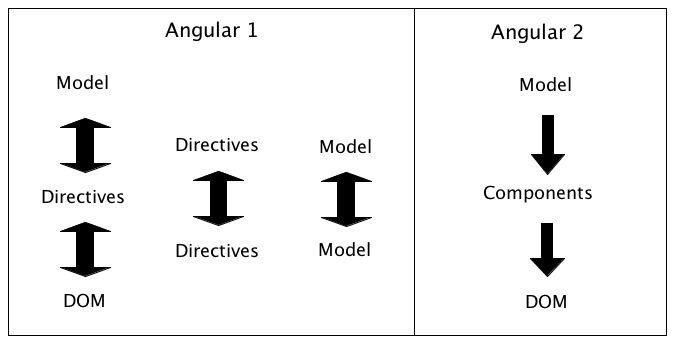

# Part 6: Change Detection

In Angular 1, the framework kept a long list of watchers (one for every property bound to our templates) that needed to be checked everytime a change was detected in our application. This was called *dirty checking* and it was the only change detection strategy available.

Because by default Angular 1 implemented two way data binding, the flow of changes was pretty much chaotic, models were able to change directives, directives were able to change models, directive

- Models were able to change the directives (`$scope`) and directives were able to change models.
- Directives (`$scope`) were able to change its template (`DOM`) and the end user interacting with the template were able to change the directive.
- Directives were able to change another directives.
- Models were able to change another models.

In Angular 2, **the flow of information is unidirectional**, even when using `ngModel` to implemente two way data binding, that is only syntactic sugar on top of unidrectional flow. In this new version of the framework, our code is responsible to update the models and propagate changes to other models if needed. Angular is only going to be responsible to reflect those changes in the components and the DOM by means of the change detection.

*Change detection strategies in Angular 1 vs Angular 2* 



Another difference between both versions of the frameworks is the way the nodes of an application (directives or components) are checked to see if the DOM needs to be updated.

Because of the nature of two way data binding, in Angular 1 there was no guarantee that a parent node should be checked always before a child node. It was perfectly possible that a child node could also change a parent node or a sibling or any other node in the tree, and that in turn will trigger new updates down the chain. This made difficult for the change detector to traverse all the nodes without falling in a circular loop with the infamous message:

```
10 $digest() iterations reached. Aborting!
```

In Angular 2, there is a guarantee that changes are propagated in an unidirectional way so the change detector **can traverse only 1** all the nodes of the application, starting always from the root. That means that a parent component is always checked first than its children components.

*Tree traversing in Angular 1 vs Angular 2*


Let's see how it works with a simple example.

We are going to create a simple `MovieApp` to show information about one movie. This app is going to consist of two components, the `MovieComponent` who shows information about a movie and the `MainComponent` which holds a reference to the movie and buttons to perform actions.

As always, the first step is to create our `index.html` file calling a root component of our app `MainComponent`.

*index.html*
```html
<html>
  <!-- ... -->
  <body>
    <main>Loading...</main>
  </body>
</html>
```

Then, our `MainComponent` will have three properties, the `title` of the movie and the lead `actor`. All these properties are going to be passed to the `MovieComponent` element, referenced in the template.

*app/main.component.ts*
```javascript
import {Component} from 'angular2/core';
import {bootstrap} from 'angular2/platform/browser';
import {MovieComponent} from './movie.component';
import {Actor} from './actor.model';

@Component({
  selector: 'main',
  directives: [MovieComponent],
  template: `
    <h1>MovieApp</h1>
    <p>{{ slogan }}</p>
    <button type="button" (click)="changeActorProperties()">Change Actor Properties</button>
    <button type="button" (click)="changeActorObject()">Change Actor Object</button>
    <movie [title]="title" [actor]="actor"></movie>`
})
export class MainComponent {
  slogan: string = 'Just movie information';
  title: string = 'Terminator 1';
  actor: Actor = new Actor('Arnold', 'Schwarzenegger');
  
  changeActorProperties(): void {
    this.actor.firstName = 'Nicholas';
    this.actor.lastName = 'Cage';
  }
  
  changeActorObject(): void {
    this.actor = new Actor('Bruce', 'Willis');
  }
}

bootstrap(MainComponent);
```

We notice that this component also defines two buttons that triggers different actions or methods. The `changeActorProperties` is going to update the lead actor of the movie by means of changing directly the properties of the `actor` object. In contrast, the method `changeActorObject` will change the information of the actor by creating a completely new instance of the `Actor` class.

The `Actor` model is pretty straightforward, is just a class that defines the `firstName` and the `lastName` of an actor. 

*app/actor.model.ts*
```javascript
export class Actor {
  constructor(
    public firstName: string,
    public lastName: string) {}
}
```

Finally, the `MovieComponent` shows the information provided by the MainComponent in its template. It also defines an internal method to update the `actor` object by changing its properties.

*app/movie.component.ts*
```javascript
import {Component, Input} from 'angular2/core';
import {Actor} from './actor.model';

@Component({
  selector: 'movie',
  styles: ['div {border: 1px solid black}'],
  template: `
    <div>
      <h3>{{ title }}</h3>
      <p>
        <label>Actor:</label>
        <span>{{actor.firstName}} {{actor.lastName}}</span>
      </p>
    </div>`
})
export class MovieComponent {
  @Input() title: string;
  @Input() actor: Actor;
}
```

The final result is shown in the screenshot below.


## Change Detection Strategy: Default

By default, Angular is defining certain Change Detection Strategy for every component in our application. To make this definition explicit, we can use the property `changeDetection` of the `@Component` decorator.

_app/movie.component.ts_
```javascript
// ...
import {ChangeDetectionStrategy} from 'angular2/core';

@Component({
  // ...
  changeDetection: ChangeDetectionStrategy.Default
})
export class MovieComponent {
  // ...
}
```

The enum `ChangeDetectionStrategy` defines seven strategies: `CheckOnce`, `Checked`, `CheckAlways`, `Detached`, `OnPush`, `Default` and `DefaultObserver` as can be seen in the [docs](https://angular.io/docs/ts/latest/api/core/ChangeDetectionStrategy-enum.html). We are going to concetrate in the two main ones: `Default` and `OnPush`.

Lets see what happens when a user clicks the button "Change Actor Properties" whe using the `Default` strategy. 

As we discuss before, changes are triggered by events and the propagation of changes is done in two phases: the application phase and the change detection phase.

**Phase 1 (Application):**

In the first phase, our application (or our code) is responsable for updating the models in response to some event. In this scenario, the properties `actor.firstName` and `actor.lastName` are updated.

**Phase 2 (Change Detection):**

Now that our models are updated, angular needs to update the templates using the Change Detection.

Change Detection always starts at the root component, in this case the `MainComponent` and it checks if any of the model properties bound to its template have changed, comparing the old value of each property (before the event was triggered) to the new one (after the models were updated). The MainComponent template has a reference to three properties, `slogan`, `title`, and `actor`, so the comparison made by the Change Detection will look like:

- Is `(old)slogan === (new)slogan` Yes.
- Is `(old)title === (new)title`? Yes.
- Is `(old)actor === (new)actor`? Yes.

Notice that even if we clearly changed the properties of the actor object, we are always working with the same `actor` instance so a shallow comparison will always return `true`. Even that apparently nothing changed in the template, the **default strategy** for the Change Detection is to traverse **all** the components of the tree whether or not they seem to be modified.

Next, change detection is going to check the properties bound to the `MovieComponent`'s template doing a similar comparison:

- Is `(old)title === (new)title`? Yes.
- Is `(old)actor.firstName === (new)actor.firstName`? **No**.
- Is `(old)actor.lastName === (new)actor.lastName`? **No**.

Finally, Angular has detected that some of the properties bound to the template have changed so it will update the DOM to get the view in sync with the model.

### Performance Impact

Traversing all the tree component to check for changes could be costly. Imagine that instead of just having one reference to `<movie>` inside our `MainComponent`'s template, we have multiple references?

```html
<movie *ngFor="#movie of movies" [title]="movie.title" [actor]="movie.actor"></movie>`
```

If our movie list grows too big the performance of our system could start degrading. We can narrow the problem to one particular comparison:

- Is `(old)actor === (new)actor`?

As we have learned, this result is of not much use because we could have changed the properties of the object without changing the instance and the result of the comparison will always be `true`.

What if we can find a way to indicate to the Change Detection that our `MovieComponent` depends only on its inputs and that this condition can be guaranteed (pseudo code)?:

```
if `(old)actor === (new)actor`
  then `(old)actor.firstName === (new)actor.firstName`
   and `(old)actor.lastName  === (new)actor.lastName`.
 ```

If this can be guaranteed, then when checking the inputs of the `MovieComponent` and having this result:

- Is `(old)title === (new)title`? Yes.
- Is `(old)actor === (new)actor`? Yes.

Then we can skip the internal check of the component's template because we are now certain that nothing has changed internally and there's no need to update the DOM. This will improve the performance of the Change Detection system because fewers comparison has to be made to propagate changes through the app.

## Change Detection Strategy: OnPush

To inform Angular that we are going to complain with the conditions mentioned before to improve performance, we are going to set the `OnPush` change detection strategie on the `MovieComponent`.

_app/movie.component.ts_
```javascript
// ...

@Component({
  // ...
  changeDetection: ChangeDetectionStrategy.OnPush
})
export class MovieComponent {
  // ...
}
```

This will inform Angular that our component only depends on its inputs and that any object that is passed to it should be considered immutable. This time when we click the button "Change Actor Properties" nothing changes in the view.

Lets follow again the logic behind it. When the user clicks the button, the method `changeActorProperties` is called and the properties of the `actor` object get updated.

When change detector analyze the properties bound to the `MainComponent`'s template, it will see again the same picture as before:

- Is `(old)slogan === (new)slogan` Yes.
- Is `(old)title === (new)title`? Yes.
- Is `(old)actor === (new)actor`? Yes.

But this time, we told explictly Angular that our component only depends on its inputs and all of them are immutable. Angular then assumes that the `MovieComponent` hasn't change and skip the check for that component. Because we didn't enforced the `actor` object to be immutable, we end up with our model out of sync with the view.

Let's rerun the app but this time we will click the button `ChangeActorObject`. This time, we are creating a new instance of the `Actor` class and assing it to the `this.actor` object. When the Change Detection analyze the properties bound to the `MainComponent`'s template it will find:

- Is `(old)slogan === (new)slogan` Yes.
- Is `(old)title === (new)title`? Yes.
- Is `(old)actor === (new)actor`? **No**.

Because now Change Detection knows that the `actor` object changed (it's a new instance) it will go ahead and continue checking the template for `MovieComponent` to update its view. At the end, our templates and our models are going to be in sync.

## Enforcing immutability

As we could see, in a previous example we cheated a little. We told Angular that all of our inputs, including the `actor` object, were immutable objects, but we went ahead and updated its properties violating the immutability principle. As a result we ended with a sync problem between our models and our views. One way to enforce immutability is using [Immutable.js](https://facebook.github.io/immutable-js/).

Because in javascript primitive types like `string` and `number` are immutable by definition, we should only take care of the objects we are using. In this case, the `actor` object.

First, we need to install the `immutable.js` library using the command:

```
npm install --save immutable
```

Then, in our `MainComponent` we import the library and we use it to create an actor object as an immutable.


