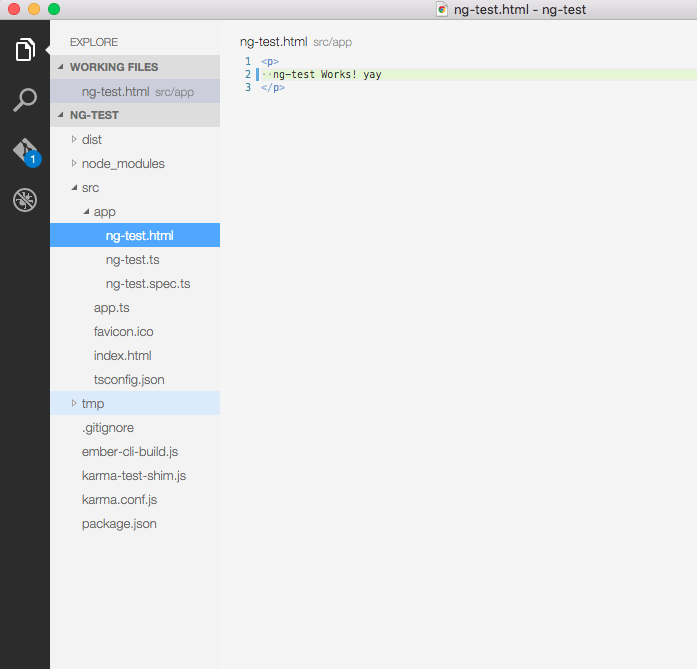

<!-- START doctoc generated TOC please keep comment here to allow auto update -->
<!-- DON'T EDIT THIS SECTION, INSTEAD RE-RUN doctoc TO UPDATE -->


- [Part 13: Project Setup](#part-13-project-setup)
  - [Angular CLI](#angular-cli)

<!-- END doctoc generated TOC please keep comment here to allow auto update -->

# Part 13: Project Setup #

## Angular CLI##

**Introduction**

The Angular CLI is a new CLI tool built by the Angular team to help developers set up their projects. It is based on the well-regarded Ember CLI used by the Ember community; for that reason you may find references to Ember in the code or commands while the tool is still under development.

The Angular CLI consists of a set of commands with blueprints attached to them.

**Prerequisites**

To make the Angular CLI work you must have node version 4 or greater installed on your system. To check the version of node you have on your system run `node -v` command and check the console output. You should see the version number there.
```shell
% node -v
v4.1.0
% npm -v
3.3.9
```
**Installation**

The Angular CLI can be installed as an npm package by running `npm install -g angular-cli`. This will take a few minutes. Once the installation has completed, you can check the CLI version as follows.
```shell
npm install -g angular-cli // installing angular-cli

% ng --version
version: 1.13.13 // checking the version
Could not find watchman, falling back to NodeWatcher for file system events.
Visit http://www.ember-cli.com/user-guide/#watchman for more info.
node: 4.1.0
npm: 2.14.10
os: darwin x64 
```

**Usage**

To create a project using the Angular CLI go to your destination folder and enter the command below. It will install the project template and its dependencies. This might take some time based on your network.

```shell
% ng new ng-test2
warning: An ember-addon has attempted to override the core command "new". The addon command will be used as the overridding was explicit.
version: 1.13.13
Could not find watchman, falling back to NodeWatcher for file system events.
Visit http://www.ember-cli.com/user-guide/#watchman for more info.
installing ng2
  create ember-cli-build.js
  create .gitignore
  create karma-test-shim.js
  create karma.conf.js
  create package.json
  create src/app/ng-test2.html
  create src/app/ng-test2.spec.ts
  create src/app/ng-test2.ts
  create src/app.ts
  create src/favicon.ico
  create src/index.html
  create src/tsconfig.json
Successfully initialized git.
Installing packages for tooling via npm...
``` 

To launch the application navigate to the application directory just created by the angular-cli and run the serve command. You should see the successful launch message in console. Navigate to URL `http://localhost:4200/` you should see the message `ng-test Works!` in the browser.

```shell
% cd ng-test
% ng serve
version: 1.13.13
Could not find watchman, falling back to NodeWatcher for file system events.
Visit http://www.ember-cli.com/user-guide/#watchman for more info.
Livereload server on http://localhost:49152
Serving on http://localhost:4200/

Build successful - 4150ms.

Slowest Trees                                 | Total
----------------------------------------------+---------------------
DiffingTSCompiler                             | 3726ms
BroccoliMergeTrees                            | 224ms

Slowest Trees (cumulative)                    | Total (avg)
----------------------------------------------+---------------------
DiffingTSCompiler (1)                         | 3726ms
BroccoliMergeTrees (1)                        | 224ms
```

Once you open the project in your text editor you should see the file structure as shown below. 



Now try to change the text in the file `ng-test.html` and you should see application compiles and auto reloads the browser. Also you would see below output in the console.

```shell
file changed app/ng-test.html

Build successful - 20ms.

Slowest Trees                                 | Total
----------------------------------------------+---------------------
BroccoliMergeTrees                            | 5ms
Funnel                                        | 4ms
DiffingTSCompiler                             | 1ms
CustomReplace                                 | 1ms
TreeStabilizer                                | 1ms
Funnel                                        | 1ms
Funnel                                        | 1ms
Funnel: index.html                            | 1ms

Slowest Trees (cumulative)                    | Total (avg)
----------------------------------------------+---------------------
Funnel (4)                                    | 7ms (1 ms)
BroccoliMergeTrees (1)                        | 5ms
DiffingTSCompiler (1)                         | 1ms
CustomReplace (1)                             | 1ms
TreeStabilizer (1)                            | 1ms
Funnel: index.html (1)                        | 1ms
```

**Generating Scaffolds**

The Angular CLI comes with scaffolding options to generate a few Angular 2 things using command line.
To generate the Angular 2 components with angular-cli:

```shell
% ng generate component my-comp
version: 1.13.13
Could not find watchman, falling back to NodeWatcher for file system events.
Visit http://www.ember-cli.com/user-guide/#watchman for more info.
installing component
  create src/app/components/my-comp/my-comp.css
  create src/app/components/my-comp/my-comp.html
  create src/app/components/my-comp/my-comp.ts
installing component-test
  create src/app/components/my-comp/my-comp.spec.ts
```

In a similar way you can generate pipe and service also for Angular 2. To see what are all the blueprints available to generate use help command. (You might see some content from ember cli here)

```shell
% ng generate --help
version: 1.13.13
Could not find watchman, falling back to NodeWatcher for file system events.
Visit http://www.ember-cli.com/user-guide/#watchman for more info.
Requested ember-cli commands:

ember generate <blueprint> <options...>
  Generates new code from blueprints.
  aliases: g
  --dry-run (Boolean) (Default: false)
    aliases: -d
  --verbose (Boolean) (Default: false)
    aliases: -v
  --pod (Boolean) (Default: false)
    aliases: -p
  --classic (Boolean) (Default: false)
    aliases: -c
  --dummy (Boolean) (Default: false)
    aliases: -dum, -id
  --in-repo-addon (String) (Default: null)
    aliases: -in-repo <value>, -ir <value>


  Available blueprints:
    ng2:
      component <name>
      component-test <name>
      ng2 <name>
      pipe <name>
      service <name>
    ember-cli:
      acceptance-test <name>
.......
```

**Production Build**

To create the distribution build just use the `build` command. It will generate the distribution folder and the compiled version of the application.

```shell
% ng build
version: 1.13.13
Could not find watchman, falling back to NodeWatcher for file system events.
Visit http://www.ember-cli.com/user-guide/#watchman for more info.
Built project successfully. Stored in "dist/".
```

**Running Tests**

The Tests can only run on the distribution build so make sure you build the project before you run the tests.
Once build is done you can just run `karma start` to run the tests.

In the future, there will only be one command for this: `ng test`.

* Angular CLI is still in development and will change over time
* There are still lot of references to Ember
* Addons like angular-cli-github-pages can be useful
* It generates all blueprints based on Typescript only
