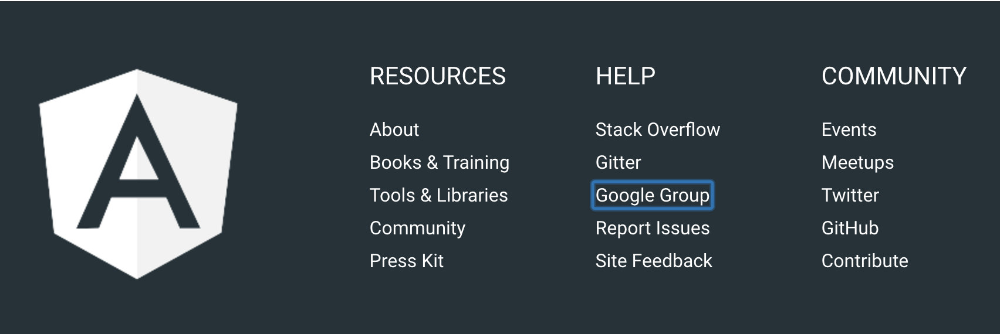

# Keyboard Accessibility

Keyboard accessibility is the ability of your application to be interacted with using just a keyboard. The more streamlined the site can be used this way, the more keyboard accessible it is. Keyboard accessibility is one of the largest aspects of web accessibility since it targets:

- those with motor disabilities who can't use a mouse
- users who rely on screen readers and other assistive technology, which require keyboard navigation
- those who prefer not to use a mouse


## Focus

Keyboard interaction is driven by something called *focus*. In web applications, only one element on a document has focus at a time, and keypresses will activate whatever function is bound to that element. The currently focused element can be accessed programmatically through the `document.activeElement` DOM method. 

Visually, an element with focus is represented by default with a glowing border around the element:



This border can be styled with CSS using the `outline` property, but it should [not be removed](http://www.outlinenone.com/). Elements can also be styled using the `:focus` psuedo-selector.


### Tabbing

The most common way of moving focus along the page is through the `tab` key. Elements will be traversed in the order they appear in the document outline - so that order must be carefully considered during development. By default, only links, buttons and form controls can receive keyboard focus.

Whenever possible, developers should bind behaviour to elements that can natively receive focus, such as using a `button` rather than a `div`. They should also adjust the source order of elements to change the tab traversal order.

There may, however, be cases where you'll want to change the default behaviour or tab order. This can be done through the `tabindex` attribute. The `tabindex` can be given the values:
  - *less than zero* - to let readers know that an element should be focusable but not keyboard accessible
  - *0* - to let readers know that that element should be accessible by keyboard
  - *greater than zero* - to let readers know the order in which the focusable element should be reached using the keyboard. Order is calculated from lowest to highest.

Altering `tabindex` [should be done carefully](http://webaim.org/techniques/keyboard/tabindex), and must also be paired with keypress support for `space` and `enter`. 

### Transitions

The majority of transitions that happen in an Angular 2 application will not involve a page reload. This means that developers will need to carefully manage what happens to focus in these cases. 

It's important that if some action involves a transition away from the natural page flow, then focus should be handled as well. 

Modals are one example of this:

```
@Component({
  selector: 'ngc2-modal',
  template: `
    <div
      role="dialog"
      aria-labelledby="modal-title"
      aria-describedby="modal-description">
      <div id="modal-title">{{title}}</div>
      <p id="modal-description">{{description}}</p>
      <button (click)="close.emit()">OK</button>
    </div>
  `,
})
export class ModalComponent {
  constructor(private modal: ModalService, private element: ElementRef) { }

  ngOnInit() {
    this.modal.visible$.subscribe(visible => {
      if(visible) {
        setTimeout(() => {
          this.element.nativeElement.querySelector('button').focus();
        }, 0);
      }
    })
  }
}
```
[View Example](https://plnkr.co/edit/Vvu62nDZ18IkqiAop2A9?p=preview)

In this example, we see that when the modal becomes visible, the `OK` button immediately receives focus. This streamlines the experience for keyboard users or screen readers to match the experience given to mouse users or those without screen readers. 
