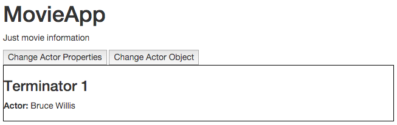

## How Change Detection Works

Let's see how change detection works with a simple example.

We are going to create a simple `MovieApp` to show information about one movie. This app is going to consist of only two components: the `MovieComponent` that shows information about the movie and the `MainComponent` which holds a reference to the movie with buttons to perform some actions.

Our `MainComponent` will have three properties: the `slogan` of the app, the `title` of the movie and the lead `actor`. The last two properties will be passed to the `MovieComponent` element referenced in the template.

_app/main.component.ts_
```javascript
import {Component} from '@angular/core';
import {MovieComponent} from './movie.component';
import {Actor} from './actor.model';

@Component({
  selector: 'main',
  template: `
    <h1>MovieApp</h1>
    <p>{{ slogan }}</p>
    <button type="button" (click)="changeActorProperties()">Change Actor Properties</button>
    <button type="button" (click)="changeActorObject()">Change Actor Object</button>
    <movie [title]="title" [actor]="actor"></movie>`
})
export class MainComponent {
  slogan: string = 'Just movie information';
  title: string = 'Terminator 1';
  actor: Actor = new Actor('Arnold', 'Schwarzenegger');

  changeActorProperties() {
    this.actor.firstName = 'Nicholas';
    this.actor.lastName = 'Cage';
  }

  changeActorObject() {
    this.actor = new Actor('Bruce', 'Willis');
  }
}
```

In the above code snippet, we can see that our component defines two buttons that trigger different methods. The `changeActorProperties` will update the lead actor of the movie by directly changing the properties of the `actor` object. In contrast, the method `changeActorObject` will change the information of the actor by creating a completely new instance of the `Actor` class.

The `Actor` model is pretty straightforward, it is just a class that defines the `firstName` and the `lastName` of an actor.

_app/actor.model.ts_
```javascript
export class Actor {
  constructor(
    public firstName: string,
    public lastName: string) {}
}
```

Finally, the `MovieComponent` shows the information provided by the `MainComponent` in its template.

_app/movie.component.ts_
```javascript
import {Component, Input} from '@angular/core';
import {Actor} from './actor.model';

@Component({
  selector: 'movie',
  styles: ['div {border: 1px solid black}'],
  template: `
    <div>
      <h3>{{ title }}</h3>
      <p>
        <label>Actor:</label>
        <span>{{actor.firstName}} {{actor.lastName}}</span>
      </p>
    </div>`
})
export class MovieComponent {
  @Input() title: string;
  @Input() actor: Actor;
}
```

The final result of the app is shown in the screenshot below:


