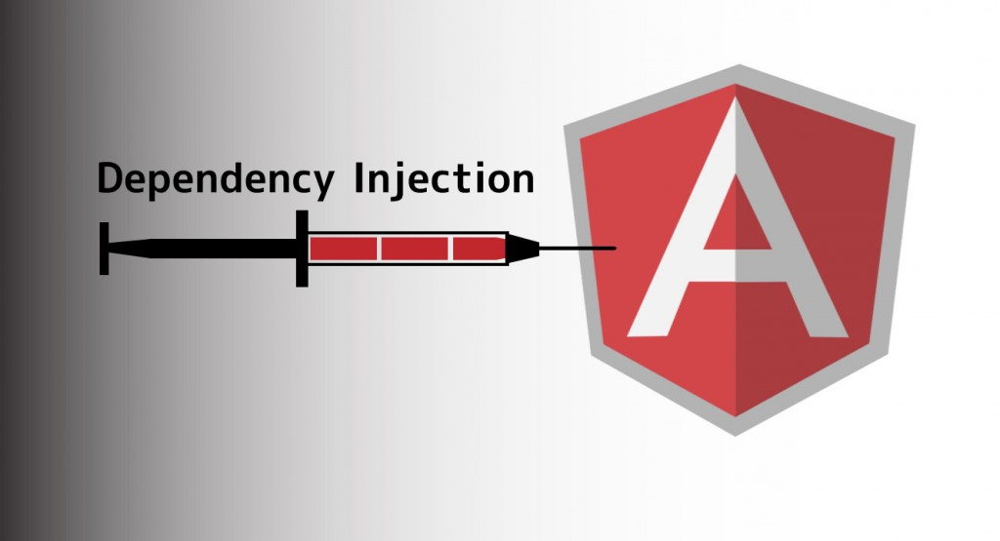

# Angular 2 Dependency Injection

Dependency Injection (DI) was a core feature in Angular 1.x, and that has not changed in Angular 2.  DI is a programming concept that predates Angular. The purpose of DI is to simplify dependency management in software components. By reducing the amount of information a component needs to know about its dependencies, unit testing can be made easier and code is more likely to be flexible.

Angular 2 improves on Angular 1.x's DI model by unifying Angular 1.x's two injection systems. Tooling issues with respect to static analysis, minification and namespace collisions have also been fixed in Angular 2.
