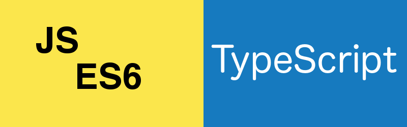

# EcmaScript 6 and TypeScript Features

The language we usually call "JavaScript" is formally known as "EcmaScript".
The new version of JavaScript, "EcmaScript 6" or "ES6", offers a number of new features that extend the power of the language.
ES6 is not widely supported in today's browsers, so it needs to be transpiled to ES5. 
You can choose between several transpilers, but we'll be using TypeScript, 
which is what the Angular team uses to write Angular 2. Angular 2 makes use of a number of features of ES6 and TypeScript.
