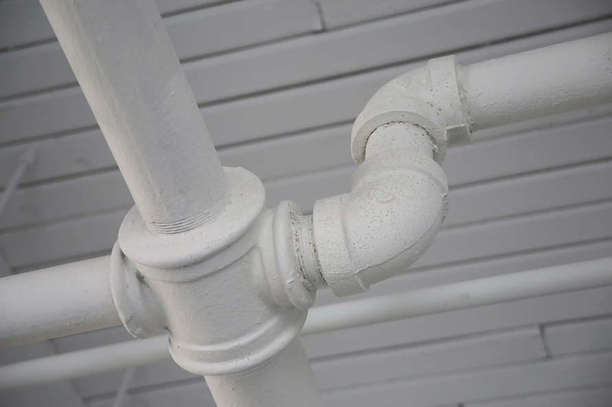

# Pipes

Angular 2 provides a new way of filtering data: `pipes`. Pipes are a replacement
for Angular 1.x's `filters`. Most of the built-in filters from Angular 1.x
have been converted to Angular 2 pipes; a few other handy ones have been included
as well.
