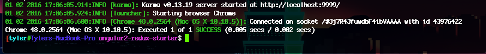

# Executing Test Scripts
Our entire testing workflow is done through Karma, running the command `karma start` will kickstart Karma into setting up the testing environment, running through each unit test, and executing any reporters we have set up in the *karma.config.js* configuration file. In order to run Karma through the command line it needs to be installed globally (`npm install karma -g`). A good practise is to amalgamate all the projects task/build commands through npm. This gives continuity to your build process and makes it easier for people to test/run your application without knowing your exact technology stack. In *package.json* there is a field `scripts` that holds an object with key-value pairing, where the key is the alias for the command, and the value is the command to be executed.

```
...
"scripts": {
	"test": "karma start",
	...
}
...
```
Now running `npm test` will start Karma. Below is the output of our Karma test, as you can see we had one test that passed, running in a Chrome 48 browser.


