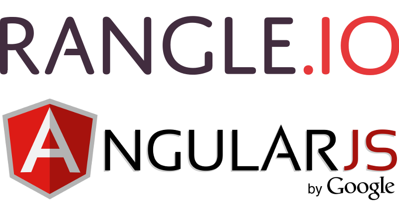

# Introduction to Angular 2 and ngCourse2

AngularJS is the leading open source JavaScript application framework backed by Google. The "1.x" version of AngularJS has been used quite widely. The new "Angular 2" version of the framework is currently available in beta. This course (ngCourse2) provides an introduction to AngularJS – using Angular 2 – based on our experience at Rangle.io.

This book walks the read through everything they need to know from getting
started with the Angular 2 toolchain to writing applications with scalable
front end architectures.
