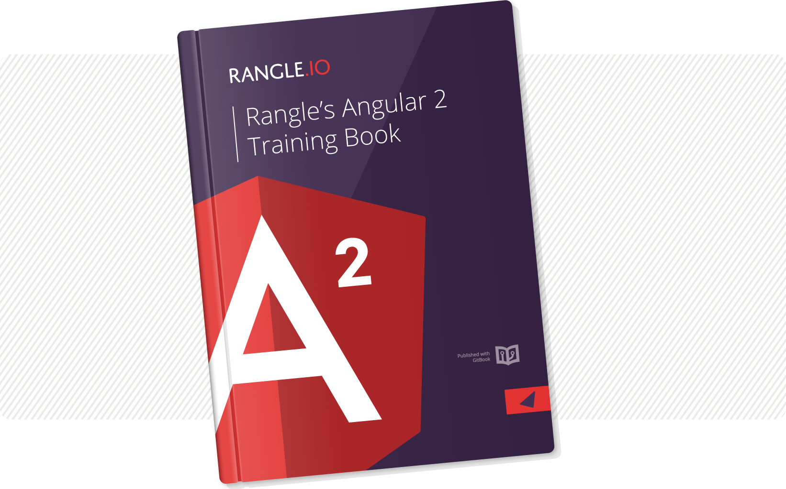

# Introduction to Angular 2 and ngCourse2

AngularJS is the leading open source JavaScript application framework backed by Google. The "1.x" version of AngularJS has been used quite widely. The new "Angular 2" version of the framework is currently available in release candidate. This course (ngCourse2) provides an introduction to AngularJS – using Angular 2 – based on our experience at Rangle.io.

This book was designed to be used as course material for Rangle's Angular 2 training.  While some sections are designed to support broader classroom discussion, the book can also serve as a stand-alone text.  It covers everything you need to know from getting
started with the Angular 2 toolchain to writing applications with scalable
front end architectures.

Rangle.io also has an [Angular 1.x book](http://ngcourse-1.rangle.io "Rangle.io's Angular 1.x Training Material")
which is geared towards writing Angular 1.x applications in an Angular 2 style.
