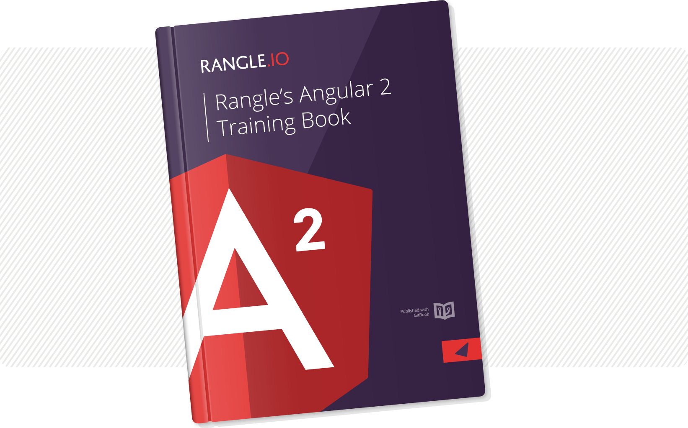

# Rangle's Angular 2 Training Book

Over the last three and a half years, AngularJS has become the leading open
source JavaScript application framework for hundreds of thousands of programmers
around the world. The "1.x" version of AngularJS has been widely used and became
extremely popular for complex applications. The new "Angular 2" has also announced its [final release version](http://angularjs.blogspot.ca/2016/09/angular2-final.html).

## About Rangle’s Angular 2 Training Book

We developed this book to be used as course material for
[Rangle's Angular 2 training](http://go.rangle.io/angular-2-training), but many
people have found it to be useful for learning Angular 2 on
their own.  This book will cover the most important Angular 2 topics, from
getting started with the Angular 2 toolchain to writing Angular 2 applications
in a scalable and maintainable manner.

If you find this material useful, you should also consider registering for one
of Rangle’s [training courses](http://go.rangle.io/angular-2-training), which
facilitate hands-on learning and are a great fit for companies that need to
transition their technology to Angular 2, or individuals looking to upgrade
their skills.

Rangle.io also has an [Angular 1.x](http://ngcourse-1.rangle.io/) book which is
geared towards writing Angular 1.x applications in an Angular 2 style. We hope
you enjoy this book. We welcome your feedback in the
[Discussion Area](https://www.gitbook.com/book/rangle-io/ngcourse2/discussions).
